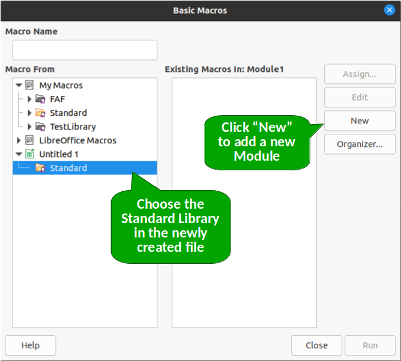
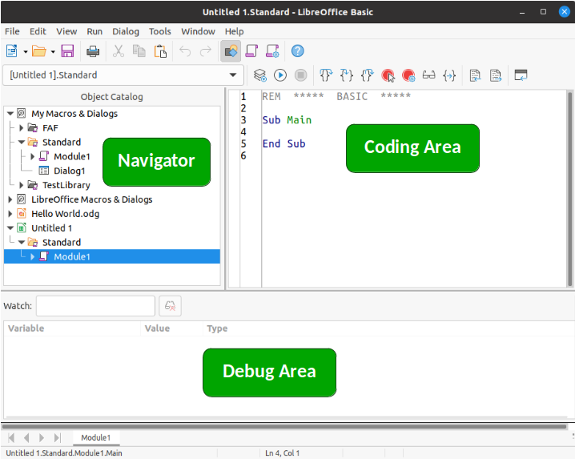

# Saying "Hello World" to LibreOffice Calc Macro programming

## Introduction

When we learn a new programming language it is very common to start with a Hello World example. The objective of such an introductory example is to provide the newcomer with an overview of how the programming language works and how code is organized.

In this tutorial we will create two versions of our Hello World macro:

1. The first one will show a Message Box with the "Hello World" message in it.
2. The second version will write the message "Hello World" into cell A1 of the currently active sheet.

Keep in mind that we won't get into a lot of details in this example because our goal here is to get you started with a complete example. In future topics we will address more complex aspects that will be overlooked here.

## Creating your First Module

In LibreOffice, macros are organized in Modules. To create your first module, open LibreOffice Calc and create a new file. Then go to **Tools > Macros > Organize Macros > Basic**. You'll be presented with the following dialog.

In the dialog window, choose the newly created Calc file on the left section named **Macro From**, which in this example is *Untitled 1*, then click **New**. A pop-up dialog will open for you to name the new module. You can use the default name *Module1* or give a different name if you prefer.

## Using the Basic IDE

After you click **OK** and create the new module, the Basic IDE (Integrated Development Environment) window will show up. The Basic IDE is where you will create and edit your macros.

More text
