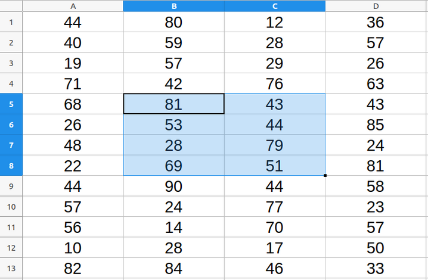

# Reading Data from Multiple Cells

In many occasions you will want to read and process values stored in multiple cells. In this topic I'll present the most common ways to get access and read data from multiple cells at once.

The first case is when the user has a single selection of multiple cells, as shown in the image below.



Lets imagine you want to see how many rows and columns there are in the current selection. The macro below shows how you can access such information and present it to the user.

```VBA
Sub CountRowsCols
	Dim selRange as Object
	Dim selCols, selRows
	'Gets the current selection
	selRange = ThisComponent.getCurrentSelection()
	'Checks if it is a single celll or a range of cells
	If selRange.supportsService("com.sun.star.sheet.SheetCell") Then
		MsgBox "A single cell is selected"
	ElseIf selRange.supportsService("com.sun.star.sheet.SheetCellRange") Then
		'Get the number of rows and columns
		selCols = selRange.Columns
		selRows = selRange.Rows
		MsgBox "The cell range has " & selRows.getCount() & " rows and " & selCols.getCount() & " columns"
	End If
End Sub
```

There are some important things in this macro. First, it checks whether the user selected a single cell (service `SheetCell`) or a cell range (service `SheetCellRange`). In case the user selected a cell range, we can use the attributes `Columns` and `Rows` to get access to all columns and rows in the selection. Finally, the method `getCount()` returns how many rows and columns are in the selected cell range.

Instead of using the current selection, we can use the method `getCellRangeByName()` and selected a fixed range as in the example below:

```VBA
Sub CountGreaterThanFifty
	Dim selRange as Object
	selRange = ThisComponent.Sheets(0).getCellRangeByName("B5:D10")
	'Gets the number of rows and columns in the selection
	Dim nRows as Integer, nCols as Integer
	nRows = selRange.Rows.getCount()
	nCols = selRange.Columns.getCount()
	Dim contValues as Integer
	Dim oCell as Object
	'Iterate over all cells in the selection
	For i = 0 To nCols - 1
		For j = 0 To nRows - 1
			value = selRange.getCellByPosition(i, j).getValue()
			If value > 50 Then contValues = contValues + 1
		Next j
	Next i
	'Shows a message with the number of cells greater than 50
	MsgBox "There are " & contValues & " cells with value greater than 50"
End Sub
```

The macro above counts how many cells in the range *B5:D10* have values greater than 50. To iterate over all cells in the selection we need to use the `getCellByPosition` method. However, note that this method is being applied to the selection instead of the entire sheet. This means that position (0, 0) is actually the first cell in the selection, which in this example is cell *B5*.

```VBA
```

```VBA
```
